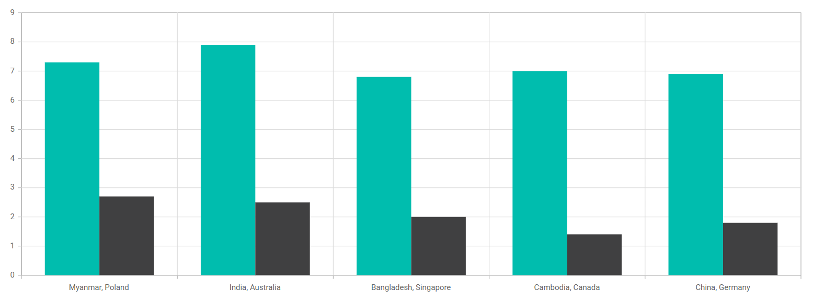
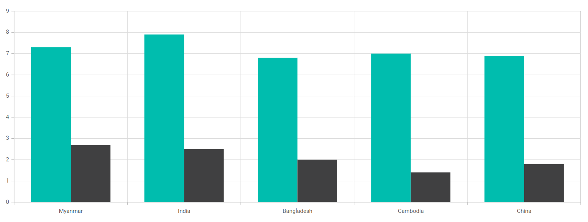

# How-to-remove-comma-in-category-axis-label-in-Blazor-chart

This article explains how to remove comma in indexed category axis labels in Blazor Chart Component.

**Customize to remove comma in indexed category axis labels in Blazor chart**

To display the x-values of the first series in the axis labels, instead of showing all x-values separated by commas, you can use the [OnAxisLaberRender](https://help.syncfusion.com/cr/blazor/Syncfusion.Blazor.Charts.ChartEvents.html#Syncfusion_Blazor_Charts_ChartEvents_OnAxisLabelRender) event in the **Indexed Category Axis**. This event allows customization of the axis labels according to your preferences.

The code snippet below demonstrates how to remove commas from **Indexed Category Axis** labels using the [OnAxisLaberRender](https://help.syncfusion.com/cr/blazor/Syncfusion.Blazor.Charts.ChartEvents.html#Syncfusion_Blazor_Charts_ChartEvents_OnAxisLabelRender) event.

**Index.razor**

```cshtml

@using Syncfusion.Blazor.Charts

<SfChart>

    <ChartPrimaryXAxis IsIndexed="true" ValueType="Syncfusion.Blazor.Charts.ValueType.Category">
    </ChartPrimaryXAxis>

    <ChartEvents OnAxisLabelRender="OnLabelRender"></ChartEvents>

    <ChartSeriesCollection>
        <ChartSeries DataSource="@WeatherReports1" XName="X" YName="Y" Type="ChartSeriesType.Column">
        </ChartSeries>
        <ChartSeries DataSource="@WeatherReports2" XName="X" YName="Y" Type="ChartSeriesType.Column">
        </ChartSeries>
    </ChartSeriesCollection>

</SfChart>

@code {
    
    public class WeatherData
    {
        public string X { get; set; }
        public double Y { get; set; }
    }

    public List<WeatherData> WeatherReports1 = new List<WeatherData>
    {
        new WeatherData{ X= "Myanmar", Y= 7.3 },
        new WeatherData{ X= "India", Y= 7.9 },
        new WeatherData{ X= "Bangladesh", Y= 6.8 },
        new WeatherData{ X= "Cambodia", Y=7.0 },
        new WeatherData{ X= "China", Y= 6.9 }
    };

    public List<WeatherData> WeatherReports2 = new List<WeatherData>
    {
        new WeatherData{ X= "Poland", Y=2.7 },
        new WeatherData{ X= "Australia", Y=2.5 },
        new WeatherData{ X= "Singapore", Y=2.0 },
        new WeatherData{ X= "Canada", Y=1.4 },
        new WeatherData{ X= "Germany", Y=1.8 }
    };

    public void OnLabelRender(AxisLabelRenderEventArgs args)
    {
        if(args.Axis.Name == "PrimaryXAxis")
        {
            args.Text = args.Text.Split(',')[0].Trim();
        }
    }
}

```

Comparatively, the screenshots below illustrate the outcome of the preceding code snippet.

**Output:**
| Before Solution | After Solution |
| ------ | ------ |
|   |   | 

**Conclusion**

I hope you enjoyed learning how remove comma from axis label in Blazor Chart Component.

You can refer to our [Blazor Chart feature tour](https://www.syncfusion.com/blazor-components/blazor-charts) page to know about its other groundbreaking feature representations and [documentation](https://blazor.syncfusion.com/documentation/chart/getting-started), and how to quickly get started for configuration specifications. You can also explore our [Blazor Chart example](https://blazor.syncfusion.com/demos/chart/line?theme=bootstrap5) to understand how to create and manipulate data.

For current customers, you can check out our components from the [License and Downloads](https://www.syncfusion.com/sales/teamlicense) page. If you are new to Syncfusion, you can try our 30-day [free trial](https://www.syncfusion.com/downloads/blazor) to check out our other controls.

If you have any queries or require clarifications, please let us know in the comments section below. You can also contact us through our [support forums](https://www.syncfusion.com/forums), [support portal](https://support.syncfusion.com/create), or [feedback portal](https://www.syncfusion.com/feedback/blazor-components?control=charts). We are always happy to assist you!

